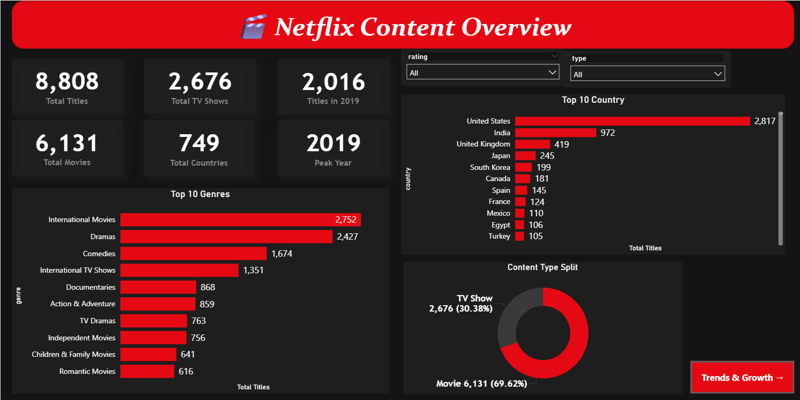
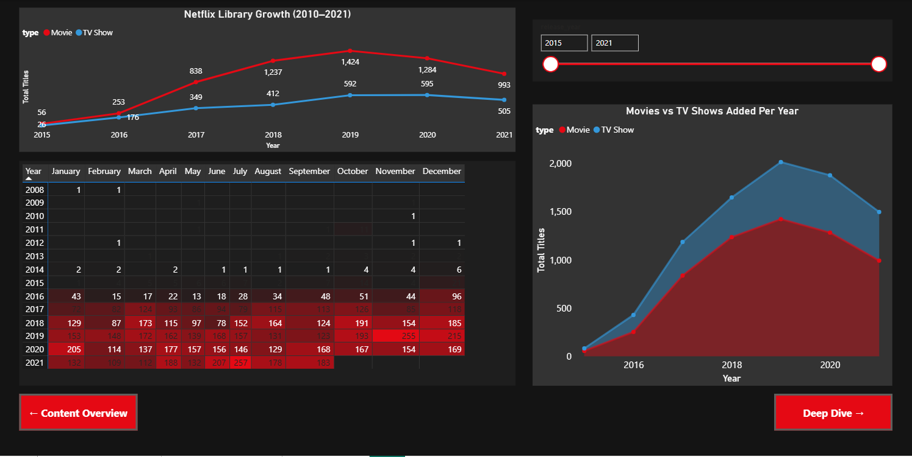
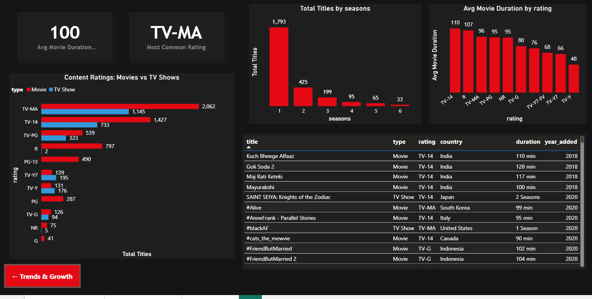

# 🎬 Netflix Content Analysis — EDA + Power BI Dashboard

> *"I picked Netflix because almost everyone has used it — and I wanted to work on a dataset that actually feels real, not just another iris or titanic."*

This is my **2nd EDA + Power BI project**, built completely from scratch — raw CSV to a fully interactive 3-page dashboard. The goal was to treat it like a real analyst would: clean the data properly, explore it step by step in Python, find patterns that are actually worth talking about, and then present it visually in Power BI.

Took a few wrong turns along the way (the genre unpivot bug was a fun one), but honestly that's where most of the learning happened.

---

## 🔗 Quick Links

[](https://www.linkedin.com/in/saurabhanand56/)
[](https://github.com/SaurabhAnand56)
[](https://app.powerbi.com/view?r=eyJrIjoiZDk4YmJmYjQtMjA5NC00NjI4LTg0OTMtOTU5NWMxOGRkYzgxIiwidCI6ImRmODY3OWNkLWE4MGUtNDVkOC05OWFjLWM4M2VkN2ZmOTVhMCJ9)

---

## 📁 Project Structure

```
Netflix-EDA/
│
├── dataset/
│   └── netflix_titles.csv            # Raw dataset (8,808 titles, 12 columns)
│
├── notebook/
│   └── Netflix_EDA.ipynb             # Full EDA — 10 steps, 42 cells
│
├── images/
│   ├── content-overview.png          # Dashboard Page 1
│   ├── trends-and-growth.png         # Dashboard Page 2
│   └── deep-dive.png                 # Dashboard Page 3
│
├── powerbi/
│   └── Netflix_Dashboard.pbix        # Power BI file
│
└── README.md
```

---

## 📊 Dashboard Preview

### Page 1 — Content Overview


### Page 2 — Trends & Growth


### Page 3 — Deep Dive


---

## 🗂️ About the Dataset

Source: [Netflix Shows — Kaggle](https://www.kaggle.com/datasets/shivamb/netflix-shows)

8,808 titles. 12 columns. Covers everything on Netflix up to 2021 — movies, TV shows, ratings, directors, cast, countries, genres and more. The data looks clean at first glance but has some real issues once you dig in (missing directors, multi-value genre columns, inconsistent duration formats).

| Column | What it holds |
|---|---|
| `show_id` | Unique ID per title |
| `type` | Movie or TV Show |
| `title` | Name of the title |
| `director` | Director — missing for ~30% of entries |
| `cast` | Main cast members |
| `country` | Country of production |
| `date_added` | Date added to Netflix |
| `release_year` | Original year of release |
| `rating` | Content rating (TV-MA, R, PG-13, etc.) |
| `duration` | Minutes (movies) or seasons (TV shows) |
| `listed_in` | Genre tags — comma-separated |
| `description` | Short summary |

---

## 🐍 EDA Notebook — What's Inside

**42 cells across 10 structured steps.** I tried to keep each section clear — what I'm doing, why it matters, then the actual code. Should be easy to follow even if you're just starting out with EDA.

| Step | What's covered |
|---|---|
| 1 | Introduction — what is EDA, what are we trying to find |
| 2 | Import libraries — pandas, numpy, matplotlib, seaborn |
| 3 | Load dataset — shape, columns, dtypes, first look |
| 4 | Data cleaning — fix date types, extract durations, handle duplicates |
| 5 | Missing values — count, visualize, decide what to do |
| 6 | Univariate analysis — type split, release years, ratings, duration, genres |
| 7 | Bivariate analysis — ratings by type, countries by type, duration by rating |
| 8 | Visualizations — growth over time, heatmap, correlation, word cloud |
| 9 | Key insights — printed summary of everything found |
| 10 | Conclusion — what we learned, what to explore next |

### Run it yourself

```bash
# Clone the repo
git clone https://github.com/SaurabhAnand56/Netflix-EDA-PowerBI.git
cd Netflix-EDA-PowerBI

# Install dependencies
pip install pandas numpy matplotlib seaborn jupyter wordcloud

# Open the notebook
jupyter notebook notebook/Netflix_EDA.ipynb
```

> Place `netflix_titles.csv` inside the `dataset/` folder before running.

---

## 📈 Power BI Dashboard

3-page interactive report built in Power BI Desktop. Used a full Netflix dark theme — `#141414` canvas, `#E50914` red accents. Transformations in Power Query, metrics in DAX.

### Page 1 — Content Overview
KPI cards → Donut chart → Genre bar → Country bar → Rating bar → Slicers (type + rating)

### Page 2 — Trends & Growth
Line chart → Area chart → Monthly heatmap with red conditional formatting → Year slicer

### Page 3 — Deep Dive
Duration + rating KPIs → Grouped ratings bar → Seasons chart → Avg duration bar → Browse table

### DAX Measures

```dax
Total Titles = COUNTROWS(netflix_titles)

Total Movies =
    CALCULATE(COUNTROWS(netflix_titles), netflix_titles[type] = "Movie")

Total TV Shows =
    CALCULATE(COUNTROWS(netflix_titles), netflix_titles[type] = "TV Show")

Total Countries = DISTINCTCOUNT(netflix_titles[country])

Avg Movie Duration =
    ROUND(
        CALCULATE(
            AVERAGE(netflix_titles[duration_minutes]),
            netflix_titles[type] = "Movie"
        ), 0)

Titles in 2019 =
    CALCULATE([Total Titles], netflix_titles[year_added] = 2019)
```

### Something worth mentioning

When I split the `listed_in` (genres) column inside the main table in Power Query, every row got multiplied by the number of genres — KPI cards were showing 19K titles instead of 8,808. The fix was creating a **separate reference table** (`netflix_genres`) and linking it via `show_id`. Also had to change the cross-filter direction to **Both** in model view — otherwise the genre chart just showed the total count for everything. Took a while to debug but made complete sense once I understood how Power BI relationships work.

---

## 💡 What the Data Actually Says

- Netflix has **nearly 3x more Movies than TV Shows** — 69.6% of the library is movies
- **United States leads** with 32% of all titles. **India is second** at 11% — the global investment is clearly real
- **TV-MA is the most common rating** — Netflix builds for adults first
- **2019 was the peak year** — 2,016 titles added in a single year. Slowed down after, likely COVID impacting productions globally
- **67% of TV Shows have just 1 season** — most shows don't survive past their debut
- Average movie length is **100 minutes** — the classic feature film runtime
- The `director` column is blank for nearly **30% of titles** — mostly TV Shows. Important to know before any director-based analysis

---

## 🛠️ Tech Stack

| Tool | Used for |
|---|---|
| Python + Pandas | Data cleaning and analysis |
| Matplotlib + Seaborn | Charts and visualizations in notebook |
| WordCloud | Description text visualization |
| Jupyter Notebook | Interactive analysis environment |
| Power BI Desktop | Dashboard building |
| Power Query (M) | Data transformation |
| DAX | Custom measures and KPIs |

---

## 🔮 What I'd Build Next

- NLP on the `description` column — topic modelling, keyword extraction
- Content-based recommendation system using genre + description similarity
- Time series forecast for future content additions
- Streamlit app to make it interactive on the web

---

## 📬 Let's Connect

Currently looking for **Data Analyst** opportunities. If you have feedback, want to collaborate, or just want to connect — always up for it.

[](https://www.linkedin.com/in/saurabhanand56/)
[](https://github.com/SaurabhAnand56)

---

## 📄 License

Dataset — [CC0 Public Domain via Kaggle](https://www.kaggle.com/datasets/shivamb/netflix-shows)
Code and dashboard — free to use for learning and reference.

---

*If this was useful or gave you ideas for your own project — a ⭐ would genuinely mean a lot. Still building out my portfolio and every bit helps 🙌*
